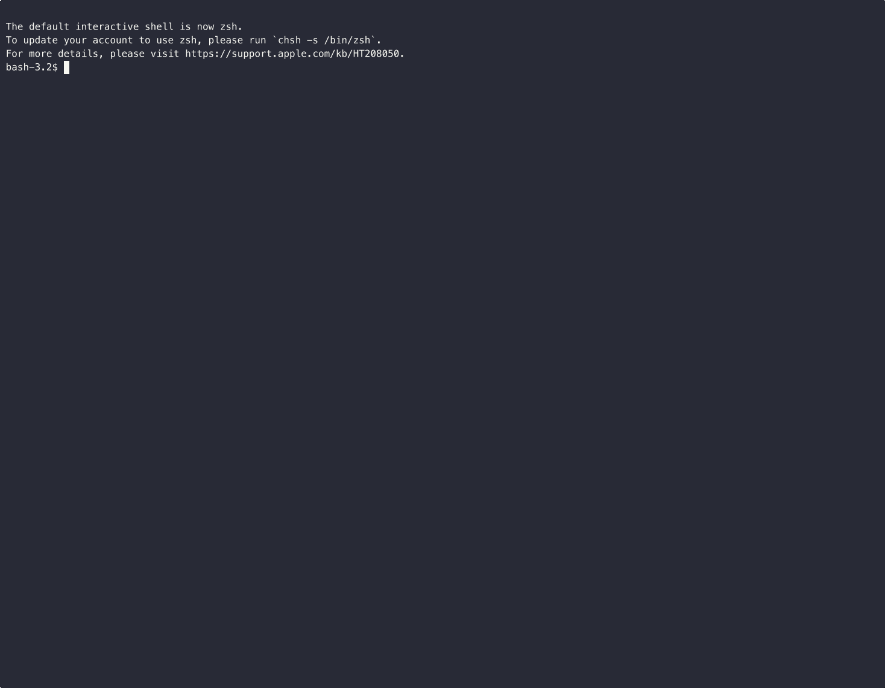

# thinking-prompt

A prompt_toolkit extension that adds a "thinking box" above the prompt for displaying AI thinking/processing content with real-time streaming updates.



## Features

- **Thinking Box**: A collapsible area above the prompt that shows processing/thinking content
- **Real-time Streaming**: Content updates in real-time as your callback returns new content
- **Fullscreen Mode**: Optional fullscreen mode with chat history (disabled by default)
- **Animated Separator**: Configurable animated indicator showing thinking is in progress
- **Rich Output**: Support for markdown rendering and syntax-highlighted code blocks
- **Customizable Styles**: Full control over colors and styling

## Installation

```bash
pip install thinking-prompt
```

For markdown and code highlighting support:
```bash
pip install thinking-prompt[all]
```

## Quick Start

```python
import asyncio
from thinking_prompt import ThinkingPromptSession, AppInfo

async def main():
    app_info = AppInfo(name="MyApp", version="1.0.0")
    session = ThinkingPromptSession(app_info=app_info, message=">>> ")

    @session.on_input
    async def handle(text: str):
        if not text.strip():
            return

        # Use context manager for clean thinking management
        async with session.thinking() as content:
            content.append("Processing...\n")
            await asyncio.sleep(0.5)
            content.append("Done!\n")

        session.add_response(f"You said: {text}")

    await session.run_async()

if __name__ == "__main__":
    asyncio.run(main())
```

## Key Bindings

| Key | Action |
|-----|--------|
| Ctrl+T | Expand/collapse thinking box (in prompt mode) |
| Ctrl+E | Toggle fullscreen mode (when enabled) |
| Ctrl+C | Cancel current operation or exit |
| Ctrl+D | Exit application |

## API Reference

### ThinkingPromptSession

The main class for creating a thinking-enabled prompt session.

```python
session = ThinkingPromptSession(
    message=">>> ",              # Prompt message
    app_info=AppInfo(...),       # App metadata and configuration
    max_thinking_height=15,      # Max lines when collapsed
    enable_status_bar=True,      # Show status bar
    echo_input=True,             # Echo user input to console
)
```

### Thinking API

**Context Manager (recommended):**
```python
async with session.thinking() as content:
    content.append("Step 1...\n")
    await asyncio.sleep(0.5)
    content.append("Step 2...\n")
# Automatically finishes when exiting context
```

**Manual control:**
```python
# Start with a content callback
chunks = []
session.start_thinking(lambda: ''.join(chunks))

chunks.append("Processing...\n")
await asyncio.sleep(0.5)

# Finish and optionally echo to console
session.finish_thinking(add_to_history=True, echo_to_console=True)
```

### Output Methods

```python
# Plain text response
session.add_response("Hello, world!")

# Markdown (requires rich)
session.add_response("# Title\n- Item 1\n- Item 2", markdown=True)

# Syntax-highlighted code (requires pygments)
session.add_code("def hello(): return 'world'", language="python")

# Status messages
session.add_success("Operation completed")
session.add_warning("Rate limit approaching")
session.add_error("Connection failed")
session.add_message("system", "Connecting to server...")
```

### Dialogs

```python
# Yes/No confirmation
result = await session.yes_no_dialog("Confirm", "Delete this item?")
if result:
    # User clicked Yes

# Message dialog
await session.message_dialog("Info", "Operation completed!")

# Choice dialog (multiple buttons)
action = await session.choice_dialog("Action", "What to do?", ["Save", "Discard", "Cancel"])

# Dropdown selection
theme = await session.dropdown_dialog("Theme", "Choose:", ["Light", "Dark", "System"])

# Custom dialog
from thinking_prompt import DialogConfig, ButtonConfig
config = DialogConfig(
    title="Custom",
    body="Choose an option:",
    buttons=[
        ButtonConfig(text="Option A", result="a"),
        ButtonConfig(text="Option B", result="b"),
    ],
)
result = await session.show_dialog(config)
```

### Settings Dialog

A form-based dialog for configuring multiple settings at once:

```python
from thinking_prompt.settings_dialog import (
    SettingsDialog,
    DropdownItem,
    InlineSelectItem,
    TextItem,
    CheckboxItem,
)

items = [
    DropdownItem(
        key="theme",
        label="Theme",
        description="Application color scheme",
        options=["Light", "Dark", "System"],
        default="System",
    ),
    InlineSelectItem(
        key="font_size",
        label="Font Size",
        options=["Small", "Medium", "Large"],
        default="Medium",
    ),
    TextItem(
        key="username",
        label="Username",
        default="Guest",
    ),
    TextItem(
        key="api_key",
        label="API Key",
        password=True,
    ),
    CheckboxItem(
        key="notifications",
        label="Enable Notifications",
        description="Show desktop notifications",
        default=True,
    ),
]

dialog = SettingsDialog(title="Settings", items=items)
result = await session.show_dialog(dialog)

if result:
    # result is a dict of changed values only
    for key, value in result.items():
        print(f"{key}: {value}")
```

**Control Types:**
| Control | Description | Navigation |
|---------|-------------|------------|
| `DropdownItem` | Expandable dropdown list with `▼` indicator | Enter to open, Up/Down to select, Enter to confirm |
| `InlineSelectItem` | Inline cycling with `◀`/`▶` indicators | Left/Right to cycle through options |
| `TextItem` | Text input (optional password masking) | Enter to edit, Enter/Escape to confirm/cancel |
| `CheckboxItem` | Boolean toggle (`true`/`false`) | Space/Enter/Left/Right to toggle |

**Navigation:** Up/Down moves between controls, Tab cycles through controls and buttons, Ctrl+S saves.

### AppInfo Configuration

```python
app_info = AppInfo(
    name="MyApp",
    version="1.0.0",
    welcome_message="Welcome to MyApp!",  # Optional custom welcome

    # Key bindings
    fullscreen_key="c-e",        # Ctrl+E for fullscreen
    expand_key="c-t",            # Ctrl+T for expand/collapse

    # Feature flags
    fullscreen_enabled=False,    # Enable fullscreen mode
    echo_thinking=True,          # Echo thinking to console after completion

    # Thinking animation
    thinking_text="Thinking",    # Text in separator
    thinking_animation=("⠋", "⠙", "⠹", ...),  # Animation frames
    thinking_animation_position="before",      # "before" or "after" text
)
```

## Examples

See the `examples/` directory for complete demos:

- `basic.py` - Simple thinking box usage
- `demo.py` - Interactive demo with simulated AI thinking
- `streaming.py` - Character-by-character streaming
- `progress_demo.py` - Progress bar with callback
- `demo_progress_line.py` - In-place progress updates
- `demo_messages_during_thinking.py` - Output messages during thinking
- `demo_animated_separator.py` - Different animation configurations
- `dialog_test.py` - Dialog system demo (yes/no, message, choice, dropdown)
- `settings_dialog_demo.py` - Settings dialog with all control types
- `demo_showcase.py` - Feature showcase for demos and screenshots
- `completer_demo.py` - Slash-command autocompletion (like Claude Code)

## License

MIT
